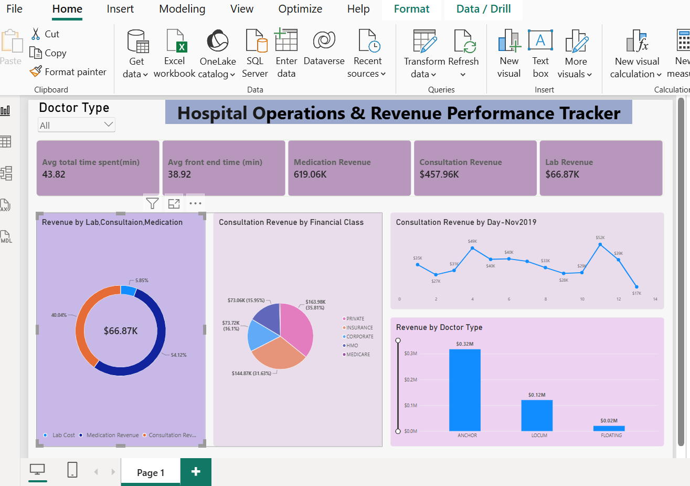

# Hospital-Operation-Dashboard
An interactive Power BI  dashboard tracking hospital operations such as revenue, consultation trends using public Kaggle data
## Dashboard Preview

## Key Project Insights
Revenue Performance Breakdown: Successfully modeled and tracked over $619K in Medication Revenue and $457K in Consultation Revenue.
Operational Monitoring: Measured  average customer processing time 43.82 min.
Segmented hospital data points by individual Doctor Types and Patient Financial Classes (Private, Corporate, Insurance) to show resource allocation opportunities.
## Tools Used
*Power BI Service & Desktop - DAX calculations, modeling, and layout design.
*Power Query - Data transformation and cleanup workflows.
*Kaggle - Dataset origin.
